# tinyparty

https://tp.crda.dev/

a lightweight macos dock-integrated music visualizer. it runs on a transparent layer behind the macos dock, rendering audio-reactive equalizer bars.

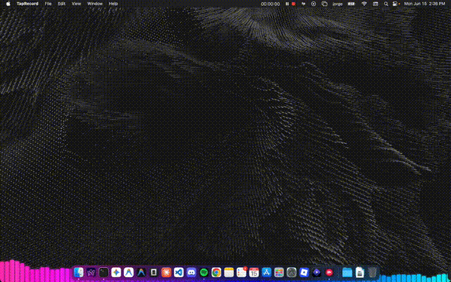

## features
*   **dock layer**: sits between the desktop wallpaper and the macos dock.
*   **click-through**: ignores mouse clicks so you can use the dock and desktop normally.
*   **styles**: supports different visualizer styles (`spectrum`, `glow`, `mesh`, `retro`) and color palettes (`neon`, `cyberpunk`, `inferno`) configured from the system tray menu.
*   **cross-platform prep**: configuration targets in `package.json` and platform-specific checks in `main.js` (for taskbar-aware bounds and tray icons) are structured to support developer ports to other operating systems.

### visual styles

| style | neon | cyberpunk | inferno |
| :---: | :---: | :---: | :---: |
| **spectrum** | 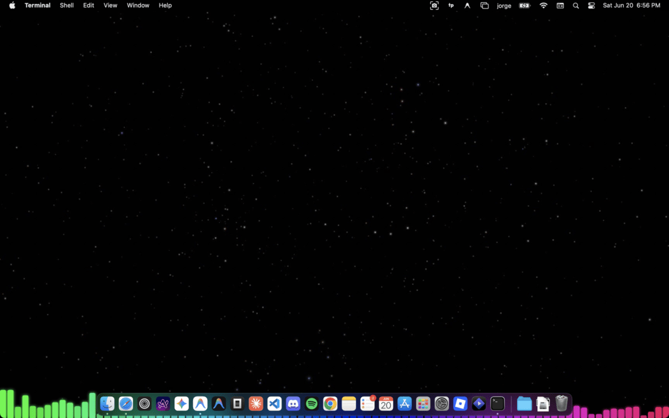 | 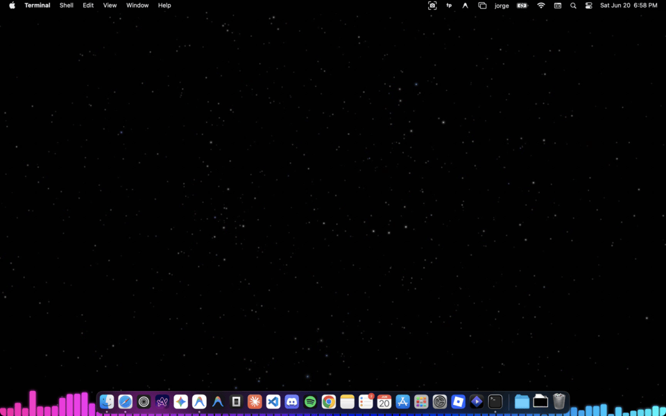 | 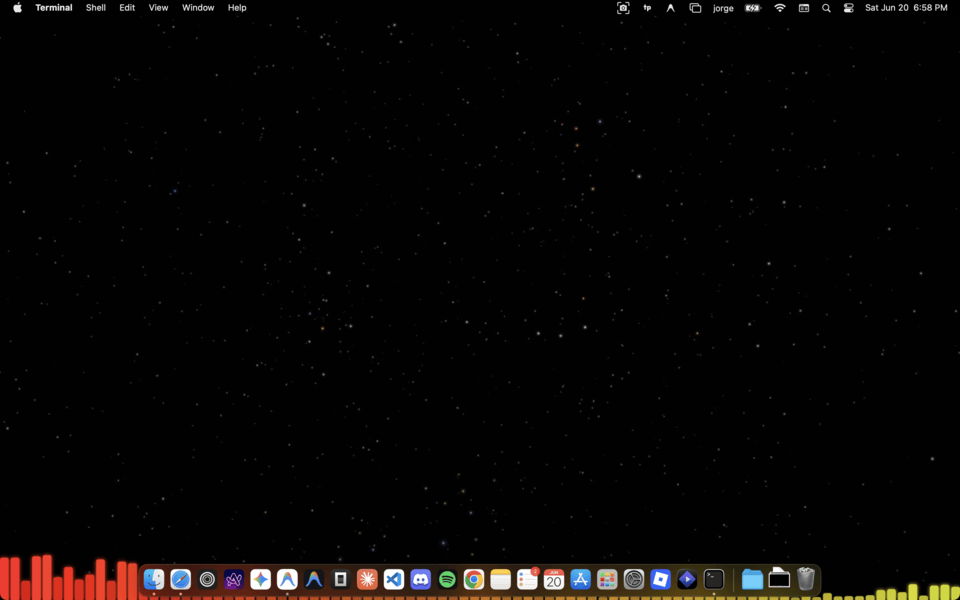 |
| **glow** | 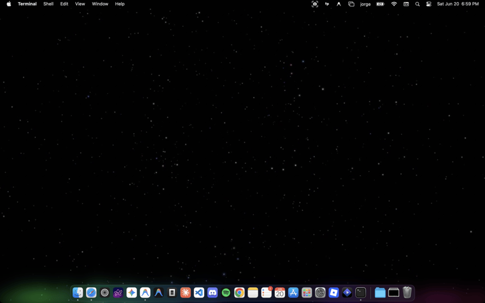 | 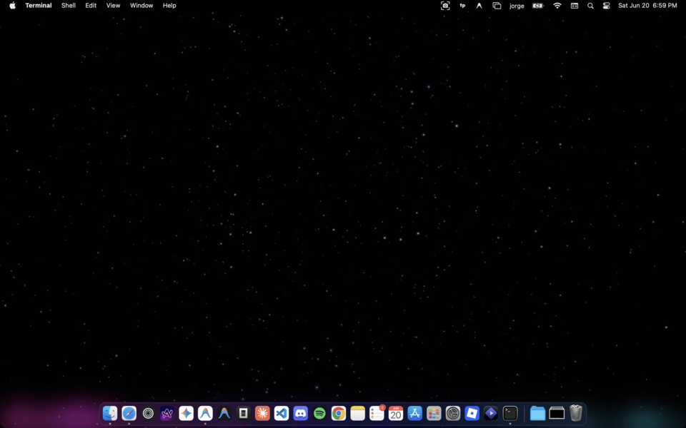 | 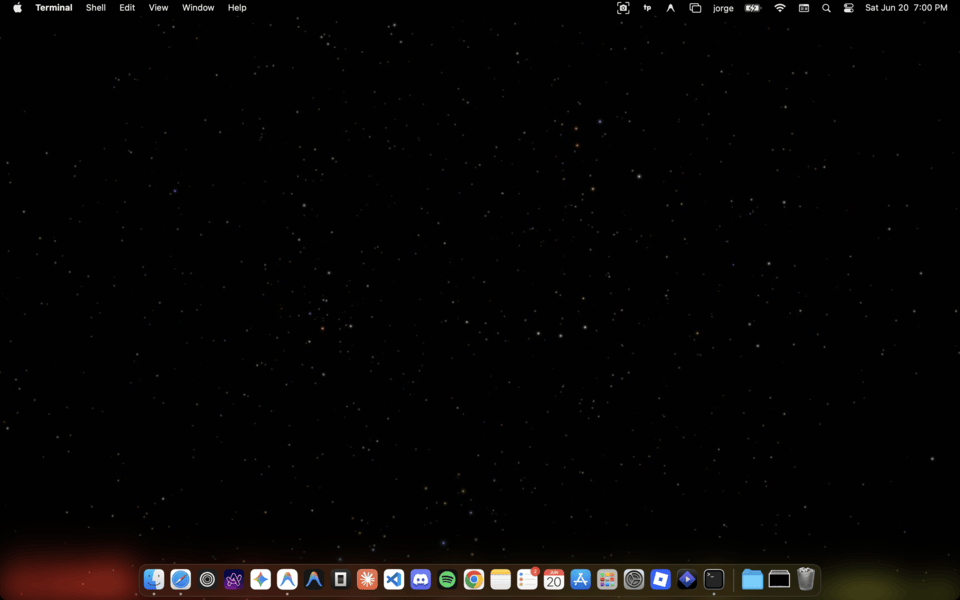 |
| **mesh** | 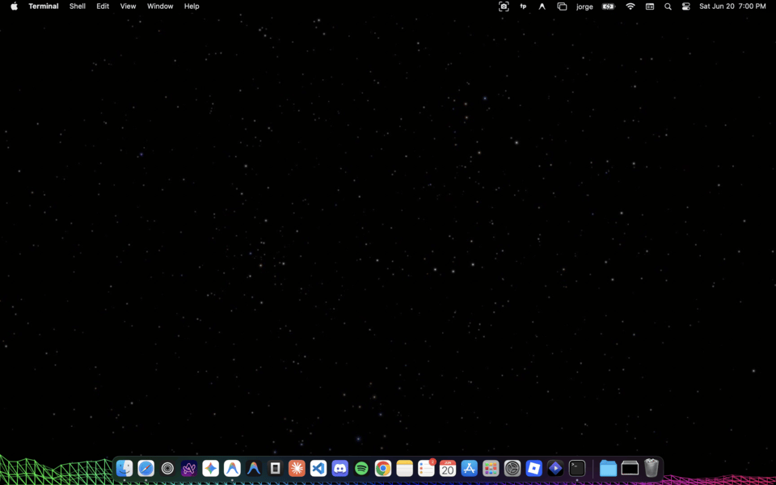 | 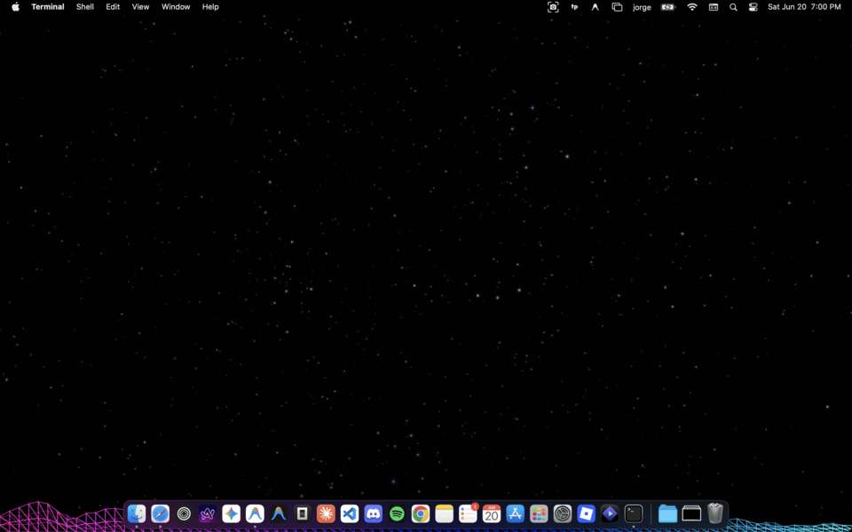 | 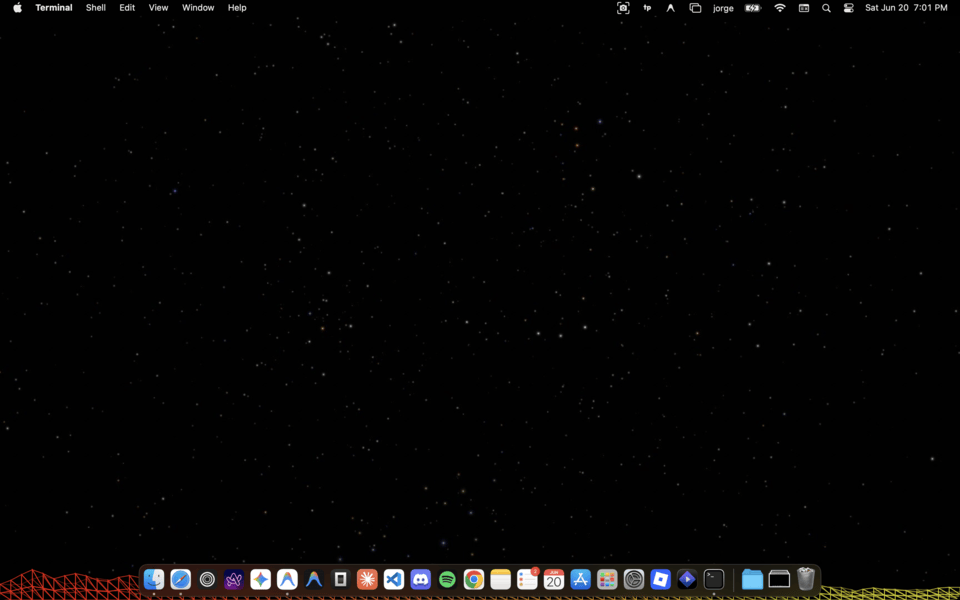 |
| **retro** | 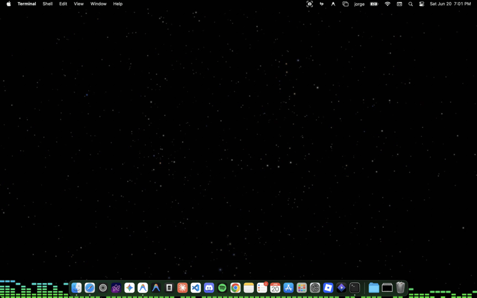 | 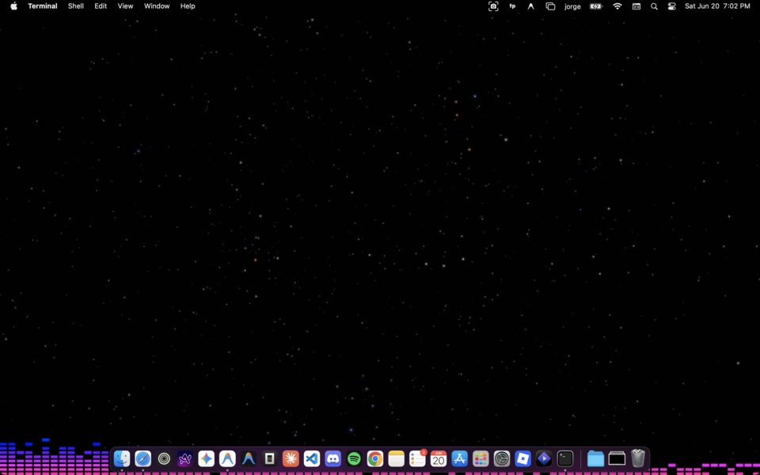 | 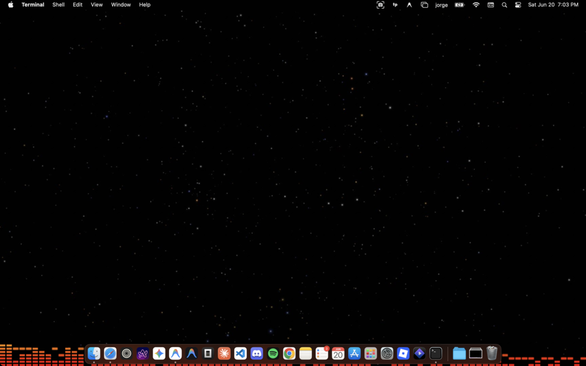 |

## tech stack
*   **runtime**: electron (`^34.0.0`)
*   **bundling/compiler**: vite (`^6.0.0`)
*   **packaging**: `electron-builder`

## file structure
```
tinyparty/
├── css/
│   └── style.css            # styling for canvas, glass overlay, and welcome card
├── js/
│   ├── app.js               # main renderer app script (canvas loop & ipc triggers)
│   └── audio.js             # wraps web audio api (audiocontext, analysernode)
├── build/
│   ├── icon.png             # app icon
│   └── entitlements.mac.plist # macos entitlement definitions (mic access)
├── main.js                  # electron main process (window bounds, tray menu, ipc)
├── preload.js               # context-bridge ipc proxy for security isolation
├── sign.sh                  # custom inside-out macos codesigning script
├── package.json             # package config, scripts, and electron-builder settings
├── vite.config.js           # vite build/dev server configuration
└── index.html               # main entry point page (contains canvas and welcome screen)
```

## development setup

### 1. install dependencies
```bash
npm install
```

### 2. run dev server
```bash
npm run dev
```

### 3. run electron
in another terminal:
```bash
npm run electron-dev
```

## packaging
```bash
npm run build
npx electron-builder --mac dir
./sign.sh
ditto -c -k --sequesterRsrc --keepParent release/mac/tinyparty.app release/tinyparty-mac.zip
npx electron-builder --mac dmg --prepackaged release/mac/tinyparty.app
codesign --force --sign - release/tinyparty-0.1.0.dmg
```

## installation
1. open the .dmg and drag `tinyparty.app` to your `/Applications` folder (or unzip `tinyparty-mac.zip` and move the app there).
2. open your terminal app (search for "terminal" in spotlight).
3. paste the following command and press enter:
   ```bash
   xattr -cr /Applications/tinyparty.app
   ```
4. open the app

## changelog

### [0.2.0] - 2026-06-20
*   **style updates**: added a static, high-reactivity 2-layer 2d `mesh` visualizer.
*   **performance**: optimized visualizer transitions with custom easing and locked visualizer window heights to prevent clipping.
*   **tray menu updates**: appended the local application version dynamically to the tray menu title (e.g., `tinyparty 0.2.0`).
*   **update checking**: integrated a background auto-update checker using the github releases api that alerts the user with an `update available...` option linking to `https://tp.crda.dev`.

### [0.1.0] - 2026-06-15
*   **initial release**: lightweight dock-integrated audio-reactive music visualizer.
*   **themes & colors**: support for 3 main themes (`spectrum`, `glow`, `retro`) and 3 color palettes (`neon`, `cyberpunk`, `inferno`).
*   **macos setup**: native microphone permissions setup and prepackaged signed `.dmg` release with gatekeeper bypass instructions.
*   **landing page**: minimalist dark-themed home page at `https://tp.crda.dev`.

